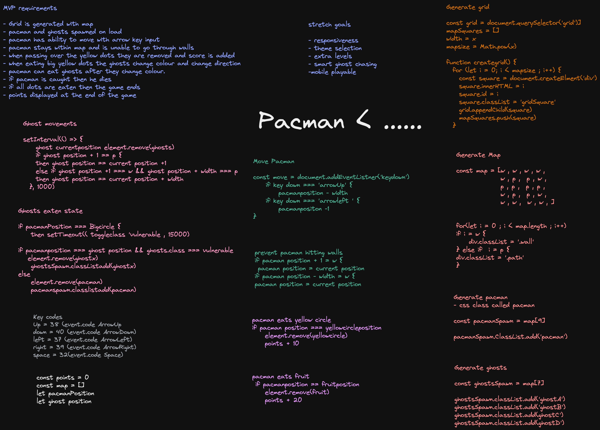

##  General Assembly, Software Engineering Immersive
# Pacman Game

### Project overview 
This was my first sizable coding project. Built using HTML, CSS and JavaScript, this is a grid-based Pacman game which allows users to control Pacman using keyboard inputs to collect pellets which add to to user score. The ghost have the ability to kill Pacman ending the game. Pacman is also able to kill the ghosts when they are vulnerable. The game includes a leaderboard created using local storage as well as a theme and map size selector, which is chosen by the user before the game begins.


### Technologies used 
* HTML
* CSS
* Javascript 


### Planning and whiteboarding 
Once I had selected Pacman as the game I would make, I spent some time thinking about the functionality I would like the site to have as well as how I wanted it to look. Once I had a basic layout and features in mind I began the process of whiteboarding. I thought carefully about each element of the game's functionality and which steps would need to be taken to get each step working. As this was my first sizable coding project I wanted to be sure that I understood the logic behind each feature and how I could implement this logic in code. I spent some time writing pseudo code for various elements that would help me when coding the project.

The final step in the planning process was working out a project timeline and setting a target date for a working MVP project. Once this was established I made a list of stretch goals which I could implement once this MVP was working. 


</img>


### Workflow 

The timeline I had come up with during the planning stages of the project split the timeline into three sections. 

#### planning - days 1 - 3
I decided to spend the first 3 days planning. As this was my first sizeable coding project I decided that planning was impprtant and was worth spending a significant amout of time on ensure I felt comfortable with the project and that I had a grasp of the main functionalities I needed to create. 

#### MVP - days 3 - 13
The mvp stage of the project would take up the remaining part of the first two weeks. In this stage I set out to get the basic functionalities of the game working correctly and get the game to a stage where it was both playable and functional. I started by creating and rendering the game map using an array of strings each one represented a type of square, I then wrote a function which mapped through this and rendered a grid which would be used to determine movements later on in the project.

The second stage was to get the Pacman and ghost moving around the board. I started working on the ghost movement and a explanation of how I got this working can be found below. I then moved on to getting Pacman moving in response to user keyboard inputs. The process getting these working as expected took around 2 days.

Following on from this I focused on getting some of the more advanced elements of the MVP working these being the eating of pellets ghost killing pacman and the ghosts becoming vulnerable with the ability to be eaten by Pacman. This took around 5 days to get working correctly. 

The remaining time of the MVP segment was spent refactoring code to add additional ghosts into the game and get them moving correctly.

### styling and stretch goals - days 14 - 20 
The last week of the project I spent styling and working on the stretch goals I had set out earlier. 
I had applied some basic styling to the game during the past two weeeks howvever this was basic and I wanted to make it look more polished and closer to the real life version. 

During this last week I also tried to work on some stretch goals. One of these were smart ghost movements. I reasearch ways which I would be able to get the ghosts to know where on the board Pacman was and then move towards him. I spent some time research different ways of doing this using a number of online resources such as blogs and stackoverflow threads. This was really useful and I was able to gain a good grasp on the logic which would need to be implemented in order to get this feature to work. Unfortunetly Implementing this in the code was trickier than I had anticipated and despite attempting this, time was running short and I decided to not implement this in the final product and instead to focus on other stretch goals. I spent the remaining few days adding in the landing page and other pages as well as polishing the product and adding additional styling.

### Featured code - Ghost Movements

One of the major challenges in creating this project was getting the ghost movement working. Initially I created a simple function to get one ghost movement before later scaling it up. In the initial build the ghost details were contained in separate lets and constants however when adding more ghosts it was necessary to change so there was not necessary repetition of code. To achieve this I placed all of the needed details and variables in an array of objects which could be easily accessed in future functions. the variable was assigned so that values such as position could be updated as needed. 

```js
    let ghosts = [
  {
    "ghost": "blinky",
    "position": 161,
    "direction": "up",
    "class": "blinky",
  },
  {
    "ghost": "pinky",
    "position": 200,
    "direction": "left",
    "class": "pinky",
  },
  {
    "ghost": "inky",
    "position": 218,
    "direction": "right",
    "class": "inky",
  },
  {
    "ghost": "clyde",
    "position": 198,
    "direction": "down",
    "class": "clyde",
  }]
```

The next step was to create the ghosts and create a function to delete them when they move between squares. To do this I made the ghosts empty divs as assigned CSS classes to which gave them their appearance. The divs were appended as children to the square which the ghost position index matched. When scaling this function up to take into account multiple ghosts i wrapped the function in a for each loop to iterate over the ghost object in the array and carry out the function for each. An if statement was added to toggle the class of the ghosts when they were in the vulnerable state.


```js
function spawnGhost() {
  ghosts.forEach(charcter => {
    const ghostSpawnSquare = document.getElementById(charcter.position)
    const createGhost = document.createElement("div")
    createGhost.id = charcter.ghost
    if (ghostVulnerable === true) {
      createGhost.classList = 'ghost-vulnerable'
    } else if (ghostVulnerable === false) {
      createGhost.classList = charcter.class
    }
    ghostSpawnSquare.appendChild(createGhost)
  });
  
  function deleteGhost() {
  ghosts.forEach(charcter => {
    const deleteGhostSquare = document.getElementById(charcter.position)
    const ghostremoval = document.getElementById(charcter.ghost)
    deleteGhostSquare.removeChild(ghostremoval)
  })
}
```


To get the ghosts to move on their own I created a setInterval function which would occur every 0.5s. Like the spawn function this was also wrapped in a foreach loop to apply to all ghosts. The ghosts in this initial build move randomly. To get this working I created an array of potential directions and set the function up to return a random direction from the array. I then used a chain of if statements to determine if it was permissible for the ghost to move in that direction by checking the class of the square. if it is permissible then using the function above the ghost was removed the index position of the ghost was changed and the ghost respawn. At the end of the movement to ghostKillsPacman function was triggered to check if pacman and the ghost were at the same index.


```js 
function ghostMoves() {
  setInterval(() => {
    const ghostOptions = ['up', 'down', 'left', 'right']
    ghosts.forEach(charcter => {
      const ghostChoice = ghostOptions[Math.floor(Math.random() * ghostOptions.length)]
      if (ghostChoice === 'right' && map[charcter.position + 1].classList.contains('path') || ghostChoice === 'right' && map[charcter.position + 1].classList.contains('path-retro')) {
        deleteGhost(charcter.position)
        charcter.position += 1
        spawnGhost(charcter.position)
      } else if (ghostChoice === 'down' && map[charcter.position + mapWidth].classList.contains('path') || ghostChoice === 'down' && map[charcter.position + mapWidth].classList.contains('path-retro')) {
        deleteGhost(charcter.position)
        charcter.position += mapWidth
        spawnGhost(charcter.position)
      } else if (ghostChoice === 'left' && map[charcter.position - 1].classList.contains('path') || ghostChoice === 'left' && map[charcter.position - 1].classList.contains('path-retro')) {
        deleteGhost(charcter.position)
        charcter.position -= 1
        spawnGhost(charcter.position)
      } else if (ghostChoice === 'up' && map[charcter.position - mapWidth].classList.contains('path') || ghostChoice === 'up' && map[charcter.position - mapWidth].classList.contains('path-retro') || ghostChoice === 'up' && map[charcter.position - mapWidth].classList.contains('door-retro') || ghostChoice === 'up' && map[charcter.position - mapWidth].classList.contains('door')) {
        deleteGhost(charcter.position)
        charcter.position -= mapWidth
        spawnGhost(charcter.position)
      }
      GhostKillsPacman()
    });
  }, 500)
}
```
### Menu and UI 

I created a main menu which would display when the user opened up the site. I created four buttons one would take the user through to start the game. The second opened up a how to play page with instructions, the third opened up a leaderboard page which used local storage to display the highscores of the person who had been playing the game. The final button linked to this github repo. Each page was created dynamically with pure javascript to give the game a one page app feel. For the design I decided to keep it simple and clean with a white loading page, large readable font and accent colours which matched that of the ghosts.

In addition to the main menu I created a game settings page under the playgame menu item where the player can customise the game theme and grid size of the game using radio buttons. I created a preview image to show the player what the game would look like. It was not part of my MVP goal to make the site responsive, however the menu pages are responsive and I began to work on responsive display of the game pages however I was not able to complete this stretch goal in the allotted project time.   


### Project Screenshots 
</img>
</img>
</img>
</img>
</img>

### Wins 

* I was able to create a working Pacman game which included all of the basic functionality of the game of pacman 
* A game was created along with a menue instructional pages and leaderboard all with a clean UI.

### Lessons Learnt 

* Don't assume that code scales up easily. Once I had one ghost moving the way I wanted I assumed that the rest would be simple to code and left it as a task for later and worked on other functionality instead. This was a mistake as getting multiple ghosts working simultainiusly was a lot trickier than i had anticipated which resulted in missing my personal MVP target due to still needing to get the ghost movement functionality working. In future I will ensure that I work on one feature at a time and refactor my code as I go rather than waiting to later. 

### Bugs 
* Once the game has ended clicking on the return to menue button does not work, it restarts the game and i would need to work on redirecting this to the main page using the window.reload() functionality 
* when the page is resized some of the responsive functionality does not work correctly with the game map being distorted. In addition on the menue pages.
* clicking on back buttons in the menue pages reloads the page instead of navigating backwards in the same one page format that I planned to correct this I would rewrite the menue in react which is something that we had not studied in the firts module. 


### Future development

The main development I would like to implement is smart ghost movements. Currently the ghosts move around randomly which however I would like to rewrite the code to get the ghost to more accurately mimic the ghost behaviour from the real game making the game both more challenging for the player.

I would also like to work on making the code itself more concise and readable by going through and finding new more efficient ways of writing the code to reduce repetition and make it easier to understand, change and maintain. 

The final development I would like to implement is the creation of a mobile playable version including onscreen buttons.

